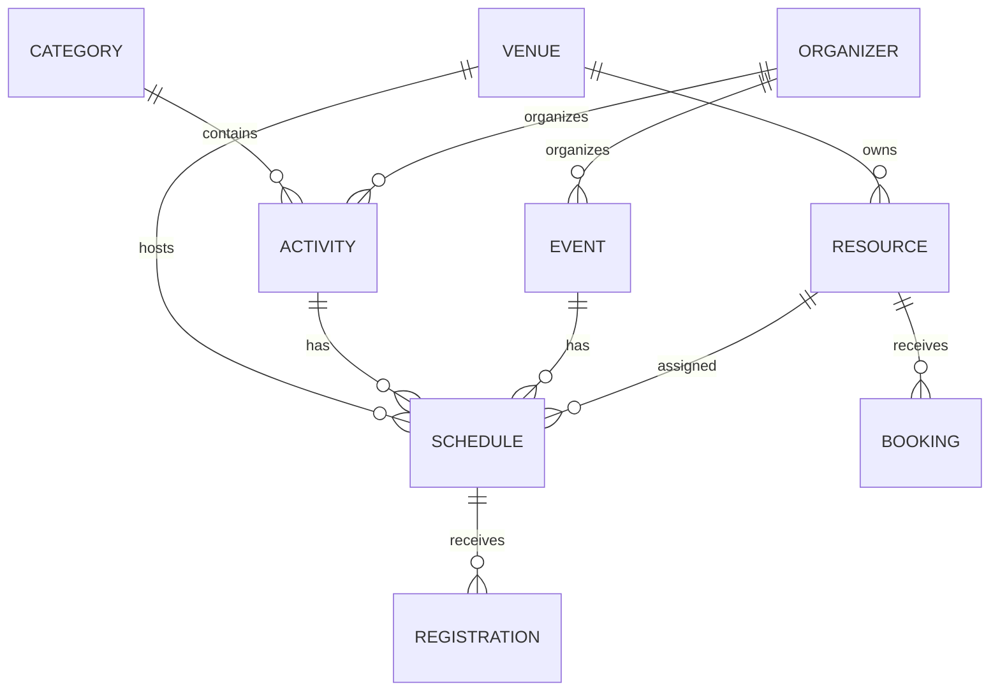

# CIIC — SRS, API và mô hình dữ liệu vận hành

## Phạm vi MVP

Hệ thống quản lý danh mục, hoạt động, địa điểm, sân/phòng/thiết bị, lịch, sự kiện, đơn vị tổ chức, đăng ký và booking. Nội dung có trạng thái bản nháp, chờ duyệt, xuất bản, tạm ẩn và kết thúc.

## Luồng người dùng

1. Người dùng mở `/hoat-dong`, tìm chương trình và chọn lịch.
2. Hệ thống kiểm tra sức chứa; đủ chỗ tạo đăng ký chờ xác nhận, hết chỗ chuyển danh sách chờ.
3. Người dùng mở `/booking`, chọn tài nguyên và thời gian.
4. Hệ thống từ chối nếu tài nguyên đã có booking chờ/đã xác nhận giao nhau.
5. Quản trị viên cập nhật trạng thái tại `/admin/operations/*`.

## ERD rút gọn

## API

- `GET /api/public/catalog?q=`: hoạt động, sự kiện, lịch và địa điểm đã xuất bản.
- `POST /api/registrations`: đăng ký lịch; tự chuyển danh sách chờ khi vượt sức chứa.
- `GET|POST /api/bookings`: tài nguyên và yêu cầu booking; trả HTTP 409 khi trùng lịch.
- `POST /api/appointments`: form quan tâm có validation, honeypot và giới hạn 5 lần/10 phút/IP.
- `GET /api/roadmap-menu`: menu public từ MongoDB.
- `GET|POST /api/admin/{collection}` và `PUT|DELETE /api/admin/{collection}/{id}`: API quản trị.

## Vai trò

Schema hỗ trợ `super_admin`, `culture_manager`, `sports_manager`, `learning_manager`, `commerce_manager`, `editor`. Hiện production dùng tài khoản quản trị tổng từ biến môi trường; chỉ bật nhiều tài khoản sau khi CIIC cung cấp nhân sự và phạm vi quyền.

## Sao lưu

- Bật MongoDB Atlas automated backup/PITR và tạo snapshot trước thay đổi schema.
- Kiểm tra khôi phục hàng quý sang database staging.
- ImageKit cần bật versioning/backup; MongoDB chỉ lưu URL ảnh.
- Không đưa URI, private key hoặc backup có dữ liệu cá nhân lên GitHub.

## Test case nghiệm thu

1. Tạo và xuất bản danh mục/hoạt động mới.
2. Một hoạt động có nhiều lịch; một địa điểm có nhiều hoạt động.
3. Đăng ký trong sức chứa nhận pending; vượt sức chứa nhận waitlist.
4. Booking trùng tài nguyên và thời gian bị từ chối 409.
5. Draft/hidden không xuất hiện public.
6. Menu mobile hoạt động bằng cảm ứng và bàn phím.
7. Upload ImageKit vào thư mục `ciic/`.
8. Form spam/honeypot bị chặn; dữ liệu hợp lệ lưu MongoDB.
